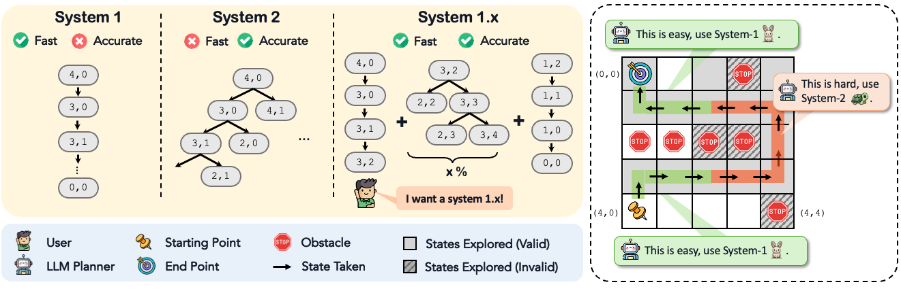
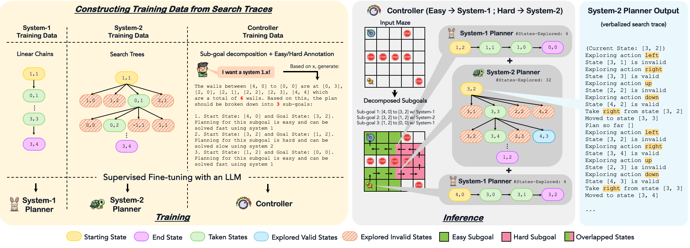

# System-1.x

[System-1.x: Learning to Balance Fast and Slow Planning with Language Models]()

[Swarnadeep Saha](https://swarnahub.github.io/), [Archiki Prasad](https://archiki.github.io/), [Justin Chih-Yao Chen](https://dinobby.github.io/), [Peter Hase](https://peterbhase.github.io/), [Elias Stengel-Eskin](https://esteng.github.io/), and [Mohit Bansal](https://www.cs.unc.edu/~mbansal/)

*Comparative Overview of System-1, System-2, and System-1.x Planning*


*Overview of System-1.x*


## Installation
This repository is tested on Python 3.9.16.  
You should install this repository on a virtual environment. All dependencies can be installed as follows:
```
pip install -r requirements.txt
```

## Datasets
The maze and blocksworld data are included in `data` folder. Each sample is a json, describing the start state, goal state, and the system 1/2 traces on which the models will be trained.

## Experiments on Maze Navigation
To run experiments on maze navigation, check out the scripts inside `scripts/maze`. 

For example, the command to train a system-1 model is:
```
bash scrips/maze/train_sys1.sh
```
Then you can evaluate the model using the following command:
```
bash scrips/maze/eval_sys1.sh
```

To train and evaluate our final System-1.5 model with sub-goal decomposition, first train a System-1 model and a System-2 model. Then execute the following commands:
```
bash scrips/maze/train_sys1.5_sg.sh
bash scrips/maze/eval_sys1.5_sg.sh
```

You can train any System-1.x model by just setting the value of x. Similarly, you can alter the search algorithm by passing `--search_algo dfs/bfs`.

## Experiments on Blocksworld
Experiments on Blocksworld follow a similar pattern. Check out the scripts inside `scrips/blocksworld`.

### Citation
```
@article{saha2023system-1.x,
  title={System-1.x: Learning to Balance Fast and Slow Planning with Language Models},
  author={Saha, Swarnadeep and Prasad, Archiki and Chen, Justin Chih-Yao and Hase, Peter and Stengel-Eskin, Elias and Bansal, Mohit},
  journal={arXiv preprint arXiv:},
  year={2024}
}
```